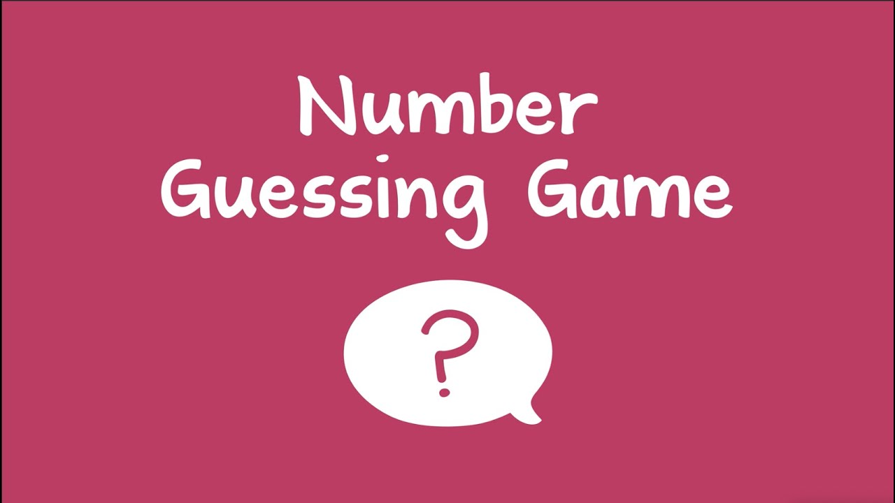

# Guess The Number 🎲

## Índice

1. [Descripción](#descripción)
2. [Características](#características)
3. [Estructura del Proyecto](#estructura-del-proyecto)
4. [Instrucciones del juego](#instrucciones-del-juego)
5. [Historias de usuario](#historias-de-usuario)
6. [Pruebas Unitarias](#pruebas-unitarias)
7. [Lenguajes y Frameworks](#lenguajes-y-frameworks)

## Descripción

"Guess The Number" es un juego en el que los jugadores intentan adivinar un número objetivo generado aleatoriamente por el sistema. El juego se juega en la consola y permite a un jugador humano competir contra una computadora para adivinar el número en la menor cantidad de intentos posibles.

El proyecto está implementado en Java y utiliza JUnit y Mockito para pruebas unitarias, asegurando la correcta funcionalidad del código.

## Características

- **Juego para un Jugador**: Permite que un jugador humano adivine el número generado por la computadora.
- **Competencia**: El jugador humano compite contra una computadora que también hace sus propias suposiciones.
- **Mensajes de Retroalimentación**: El sistema proporciona pistas sobre si el número objetivo es mayor o menor que la suposición realizada.
- **Historial de Intentos**: Muestra el historial de intentos realizados por ambos jugadores al final del juego.

## Estructura del Proyecto

- `GuessTheNumberGame.java`: Clase principal que maneja el flujo del juego.
- `Player.java`: Clase abstracta que define la estructura básica para los jugadores.
- `HumanPlayer.java`: Implementación de un jugador humano que interactúa con el usuario a través de la consola.
- `ComputerPlayer.java`: Implementación de un jugador de computadora que hace suposiciones aleatorias.
- `HumanPlayerTest.java`: Pruebas unitarias para la clase `HumanPlayer` usando JUnit y Mockito.
- `ComputerPlayerTest.java`: Pruebas unitarias para la clase `ComputerPlayer` usando JUnit y Mockito.

## Instrucciones del juego

- Ingresa tu nombre cuando se te solicite. 📝
- El juego te pedirá que hagas suposiciones sobre el número objetivo. 🎯
- El sistema te dará pistas sobre si el número es mayor o menor que tu suposición. 🔍
- El juego termina cuando uno de los jugadores adivina el número correcto. 🎉

## Historias de usuario

**Historia 1:** Registro del Jugador

- **Como:** jugador humano.
- **Quiero:** poder ingresar mi nombre.
- **Para:** que pueda ser identificado durante el juego y en los mensajes de retroalimentación.

**Criterios de Aceptación:**

* El juego debe solicitar al jugador que ingrese su nombre al inicio.
* El nombre del jugador debe ser mostrado en los mensajes de retroalimentación y en el historial de intentos.

**Historia 2: Hacer Suposición**

- **Como:** jugador humano.
- **Quiero:** hacer suposiciones sobre el número objetivo.
- **Para:** que pueda intentar adivinar el número correcto.

**Criterios de Aceptación:**

* El jugador debe poder ingresar un número en la consola como su suposición.
* El juego debe proporcionar retroalimentación sobre si la suposición es correcta, mayor o menor que el número objetivo.

**Historia 3: Juego de la Computadora**

- **Como:** jugador humano
- **Quiero:** que la computadora haga suposiciones automáticas
- **Para:** que pueda competir contra un oponente que también intenta adivinar el número.

**Criterios de Aceptación:**

* La computadora debe hacer suposiciones en cada turno de manera aleatoria.
* El juego debe mostrar las suposiciones de la computadora y las respuestas proporcionadas por el sistema.

## Pruebas Unitarias

El proyecto incluye pruebas unitarias para las clases ComputerPlayer y HumanPlayer, utilizando JUnit 5 y Mockito.

* Prueba de _ComputerPlayer_: Se utiliza un mock de _Random_ para simular la generación de números aleatorios y verificar
  que el método _makeGuess()_ devuelva la suposición correcta.
* Prueba de _HumanPlayer_: Un mock de _Scanner_ simula la entrada del jugador, asegurando que las suposiciones se registren 
  correctamente en la lista de intentos.

## Lenguajes y Frameworks

Este proyecto está desarrollado utilizando las siguientes tecnologías:

**Lenguajes:**

Java: El lenguaje principal utilizado para desarrollar la lógica del juego y sus componentes.

**Frameworks y Librerías:**

* **JUnit 5:** Usado para la creación de pruebas unitarias, asegurando la calidad y fiabilidad del código.
* **Mockito:** Utilizado para simular dependencias externas, permitiendo pruebas más aisladas y controladas.
Estas herramientas permiten un desarrollo robusto, con un enfoque en la testabilidad y calidad del software.